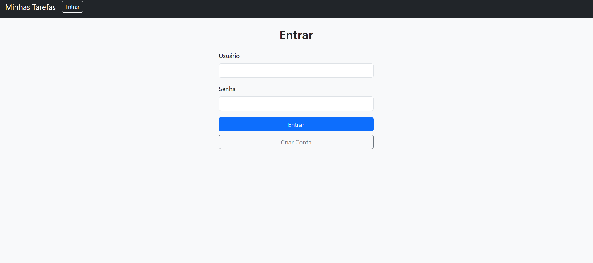

# 📋 sistema_tarefas




---

## 📌 Descrição

O **sistema_tarefas** é uma aplicação web desenvolvida com **Python e Django** para gerenciar tarefas de forma prática e eficiente. Permite que o usuário crie, edite, visualize e exclua tarefas com uma interface limpa e intuitiva. Ideal para controle pessoal ou equipes que precisam manter o fluxo de trabalho organizado.

---

## 🚀 Funcionalidades

- ✅ Cadastro de tarefas com título, descrição e prazo
- ✏️ Edição e exclusão de tarefas
- 📅 Visualização por lista
- 🟢 Marcar tarefas como concluídas
- 🔐 Autenticação de usuários (login e logout)
- 💡 Interface leve e fácil de usar

---

## 🧪 Tecnologias utilizadas

- Python 3.10+
- Django 4.2+
- SQLite3
- HTML, CSS e JavaScript

---

## 🛠️ Como rodar localmente

```bash
# Clone o repositório
git clone https://github.com/Mayke831/sistema_tarefas.git

# Acesse o diretório
cd sistema_tarefas

# Crie o ambiente virtual
python -m venv venv

# Ative o ambiente virtual
venv\Scripts\activate  # Windows
source venv/bin/activate  # Linux/Mac

# Instale as dependências
pip install -r requirements.txt

# Aplique as migrações
python manage.py migrate

# Inicie o servidor
python manage.py runserver


🤝 Como contribuir
Faça um fork

Crie uma branch: git checkout -b minha-feature

Commit: git commit -m 'Minha feature'

Push: git push origin minha-feature

Crie um Pull Request

🙋‍♂️ Autor
Feito com 💙 por Mayke831.
🔗 Acesse meu GitHub
https://github.com/Mayke831